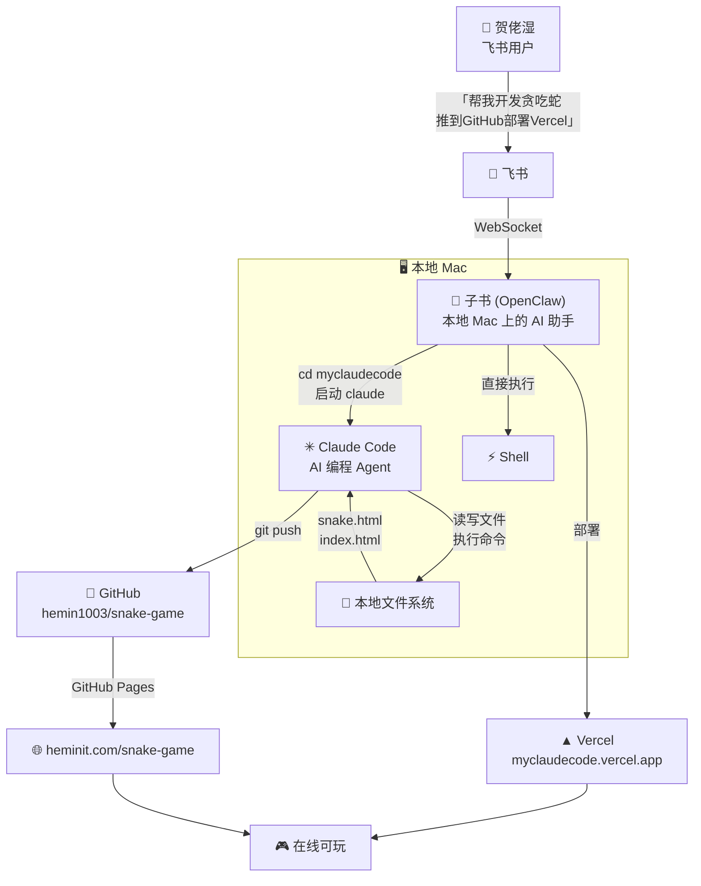

# 🐍 贪吃蛇 (Snake Game)

> 🤖 本文档由 **OpenClaw + Claude Code** 全自动生成，从编码到部署零手动操作。

## 🎮 在线试玩

| 平台 | 地址 |
|------|------|
| **Vercel** | [myclaudecode.vercel.app](https://myclaudecode.vercel.app) |
| **GitHub Pages** | [heminit.com/snake-game](http://heminit.com/snake-game/) |

## ✨ 功能特性

- 🎨 Canvas 渲染，深色主题 + 渐变蛇身 + 星星奖励
- ⌨️ 键盘方向键 / WASD 双操控
- 📱 移动端触屏滑动 + 虚拟方向键
- 📊 实时分数、最高分、速度等级
- ⭐ 金色星星 bonus（+3分，限时消失）
- ⚡ 每 5 分升一级，速度递增

## 🏗 它是怎么被创造出来的？

整个过程由 **OpenClaw（子书）** 编排，**Claude Code** 编写代码，**全程在飞书聊天框里通过自然语言完成**。



## 🔄 完整自动化流程

### Step 1: 飞书接收指令
贺佬湿在飞书里发送：*"帮我开发个贪吃蛇游戏，推送到 GitHub，部署到 Vercel"*

飞书通过 WebSocket 把消息实时推送给本地 Mac 上的 **OpenClaw 助手（子书）**。

### Step 2: OpenClaw 编排环境
子书解析意图，自动执行：
```bash
mkdir -p ~/.openclaw/workspace/myclaudecode   # 创建工作目录
claude                                         # 启动 Claude Code
```

### Step 3: Claude Code 生成代码
Claude Code 接收编程需求，自主完成：
- 分析需求 → Synthesizing 约 1 分钟
- 直接写入 `snake.html`（475 行）
- Canvas 渲染 + 键盘/WASD/触屏操控 + 分数+速度等级+星星奖励
- Git commit

### Step 4: GitHub 推送
发现 `gh` CLI 未安装，子书自动接管：
```bash
brew install gh                              # 安装 GitHub CLI
gh auth login --with-token                   # Token 认证
gh repo create hemin1003/snake-game --push   # 创建仓库并推送
```

### Step 5: 双平台部署
```bash
# Vercel 部署
npx vercel deploy --token=*** --prod --yes
→ myclaudecode.vercel.app  ✅ (7秒上线)

# GitHub Pages 自动构建
→ heminit.com/snake-game   ✅
```

## 🧩 核心角色

| 角色 | 工具 | 职责 |
|------|------|------|
| 📖 子书 | OpenClaw | 消息路由、环境编排、工具安装、多平台部署 |
| ✳ Claude | Claude Code | 代码生成、文件操作、Git 提交 |
| 🐙 GitHub | GitHub | 代码托管、Pages 静态部署 |
| ▲ Vercel | Vercel | 构建加速、CDN 全球分发 |

## ⏱ 时间线

| 时间 | 事件 |
|------|------|
| 17:34 | 飞书发送开发指令 |
| 17:37 | 启动 Claude Code 开始编码 |
| 17:39 | snake.html 生成完毕（475行） |
| 17:42 | GitHub 仓库创建 & 代码推送 |
| 17:46 | 安装 gh CLI |
| 17:57 | GitHub Pages 上线 |
| 18:08 | Vercel 部署完成 🎉 |
| **总计** | **约 35 分钟（含安装依赖 + 多次对话确认）** |

## 📂 文件结构

```
snake-game/
├── README.md                    # 本文档（OpenClaw 自动生成）
├── index.html                   # GitHub Pages 入口
├── myclaudecode/
│   ├── snake.html              # 贪吃蛇游戏（Claude Code 编写）
│   ├── index.html              # Vercel 入口
│   └── agent-coding-flow.html  # 详细流程文章
```

## 🔧 技术栈

- **AI 编排**: OpenClaw (DeepSeek V4 Pro)
- **代码生成**: Claude Code (Sonnet 4.6)
- **前端**: 纯 HTML/CSS/JS + Canvas
- **部署**: Vercel + GitHub Pages
- **消息通道**: 飞书 WebSocket

## 📝 License

MIT

---

<p align="center">
  <sub>🤖 本仓库从代码编写到 README 到部署，全部由 AI Agent 自动完成。<br>
  人类唯一做的事情：在飞书里发了一条消息。</sub>
</p>
