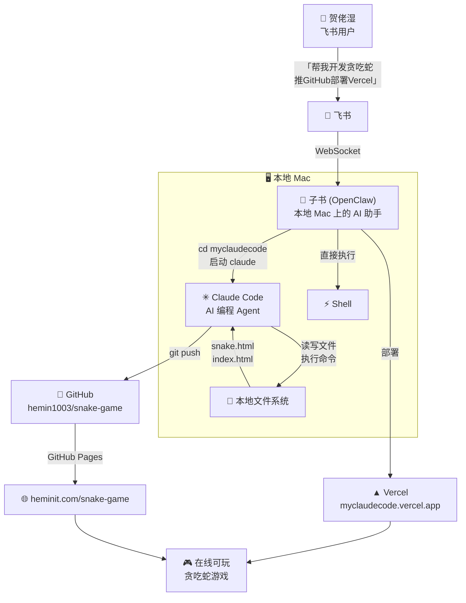
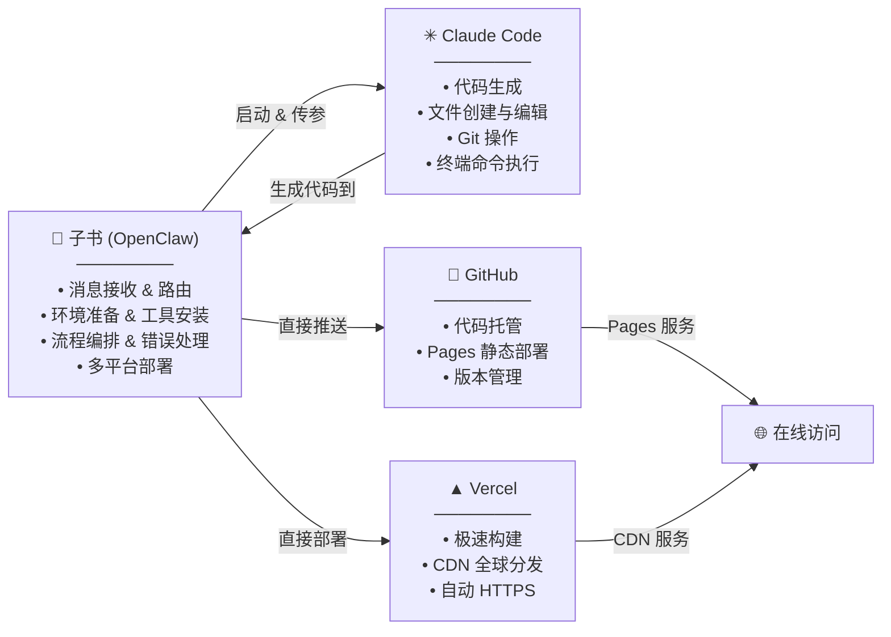
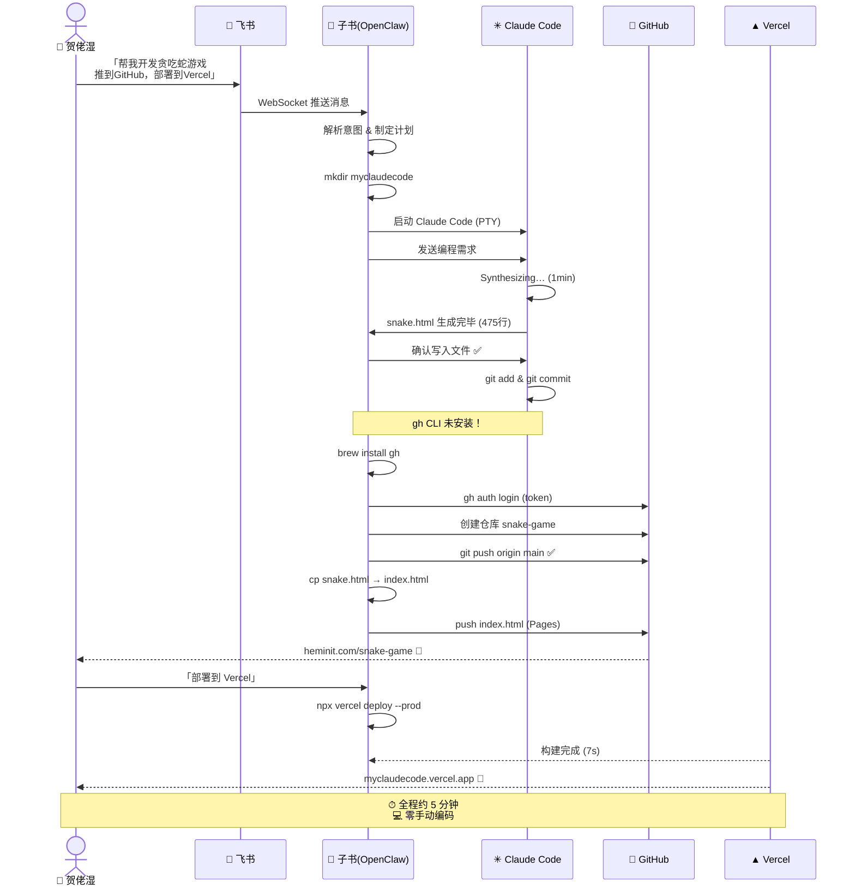

# 用 OpenClaw + Claude Code + GitHub + Vercel 实现 Agent Coding

> 从飞书发一条消息，到贪吃蛇游戏上线——全程 Agent 自动化

**一句话概括：** 在飞书里用自然语言告诉 AI 助手「帮我开发一个贪吃蛇游戏，推送到 GitHub，部署到 Vercel」，全程无需打开 IDE、无需手动敲一行代码。

---

## 🏗 架构总览



---

## 🔄 完整流程拆解

### 1. 飞书 → OpenClaw 接收指令

贺佬湿在飞书里直接发消息：`帮我开发个贪吃蛇游戏，推送到 GitHub，部署到 Vercel`。

飞书通过 WebSocket 连接把消息路由给本地 Mac 上的 OpenClaw 助手 **子书**，全程无需任何中间服务器。

> 💡 **关键点：** OpenClaw 自带飞书通道插件，配好 App ID/Secret 就能打通。消息通过 WebSocket 实时推送到本地 Gateway，延迟极低。

### 2. OpenClaw 理解意图 & 准备环境

子书（OpenClaw）解析需求，确定执行计划：

1. 创建 `myclaudecode` 工作目录
2. 启动 Claude Code 进行编码
3. 代码完成后推到 GitHub
4. 部署到 Vercel

```bash
# 子书执行的第一步
mkdir -p ~/.openclaw/workspace/myclaudecode
```

### 3. Claude Code 生成代码

子书通过终端 PTY 启动 Claude Code，把编程需求发过去：

```bash
cd ~/.openclaw/workspace/myclaudecode && claude
```

Claude Code 接到指令后：

- 分析需求（纯 HTML/CSS/JS 单文件、Canvas 渲染、键盘+触屏操控）
- Synthesizing（思考生成）约 1 分钟
- 直接写文件 `snake.html`（475 行）
- 等待确认后写入磁盘

> 💡 **关键点：** Claude Code 有自主文件读写权限，不再需要「复制粘贴代码」。它直接在当前目录创建、编辑文件，**所见即所得**。

### 4. Git 提交 & 推送 GitHub

Claude Code 写好代码后尝试推送 GitHub，但发现 `gh` CLI 未安装。子书接管后续：

```bash
# 安装 GitHub CLI
brew install gh

# 使用 token 认证
echo "ghp_xxx" | gh auth login --with-token

# 创建仓库 & 推送
gh repo create hemin1003/snake-game --public --push

# 添加 index.html 启用 GitHub Pages
cp myclaudecode/snake.html index.html
git add index.html && git commit && git push
```

> 💡 **关键点：** 当 Claude Code 遇到环境问题（缺 `gh` CLI），子书自动接手解决环境依赖，再继续推进。两个 Agent 配合互补。

### 5. GitHub Pages 自动上线

推送到 GitHub 后，子书通过 API 检查 Pages 状态，发现已自动构建：

- GitHub Pages 自动检测到仓库推送
- 构建静态站点（源自定义域名 `heminit.com`）
- 上线地址：[heminit.com/snake-game](http://heminit.com/snake-game/)

### 6. Vercel 部署

用户觉得 GitHub Pages 不够快，要求部署到 Vercel。子书直接：

```bash
# 使用 Vercel Token 一键部署
npx vercel deploy --token=vcp_xxx --prod --yes

# 输出
Production: myclaudecode.vercel.app  ✅
Ready in 7s
```

- 零配置，自动检测静态站点
- 添加 `index.html` 后重新部署
- 7 秒完成构建 + CDN 分发

---

## 🎯 最终成果

| 项目 | 地址 |
|------|------|
| **GitHub 仓库** | [github.com/hemin1003/snake-game](https://github.com/hemin1003/snake-game) |
| **GitHub Pages** | [heminit.com/snake-game](http://heminit.com/snake-game/) |
| **Vercel** | [myclaudecode.vercel.app](https://myclaudecode.vercel.app) |
| **耗时** | 从发消息到上线 ≈ 5 分钟 |

---

## 🧩 核心角色分工



---

## 📋 时序图



---

## 🔑 关键技术点

### 1. OpenClaw 的多通道消息路由

OpenClaw 通过插件体系支持飞书、微信、钉钉、Discord 等多个通道。每个通道的消息通过 Gateway 统一路由给本地 Agent，Agent 回复自动返回对应通道。

```json
// openclaw.json 中的飞书通道配置
"feishu": {
  "enabled": true,
  "appId": "cli_xxx",
  "connectionMode": "websocket"
}
```

### 2. OpenClaw 启动外部 Agent (Claude Code)

OpenClaw 通过 PTY（伪终端）启动 Claude Code，可以发送指令、读取输出、确认交互。即使 Claude Code 遇到权限确认，OpenClaw 也能代为处理。

```
exec("cd myclaudecode && claude", { pty: true })
process.sendKeys(["enter"])  // 确认文件写入
process.paste("编程需求...")
process.sendKeys(["enter"])  // 发送
```

### 3. 双 Agent 协作模式

当 Claude Code 发现环境缺少工具时（如 `gh` CLI），子书（OpenClaw）主动接管环境准备工作，而不是让 Claude Code 卡住。

### 4. Token 驱动的 API 操作

GitHub 和 Vercel 的操作都通过 Token 认证，无需手动在浏览器操作。用户只需提供一次 Token，Agent 负责后续所有调用。

---

## 🚀 总结

> **这个流程的本质：**
>
> 将「人在 IDE 里写代码 → git 推送 → 手动部署」的传统开发流程，变成「**在聊天框里说一句话 → Agent 自动完成全部**」。

**核心能力栈：**

- **OpenClaw** — 消息路由 + 环境编排
- **Claude Code** — 代码生成 + 文件操作
- **GitHub** — 版本管理 + Pages 部署
- **Vercel** — 极速构建 + CDN 分发

你不需要打开终端、不需要写一行代码、不需要手动 git commit。你只需要在飞书里说一句话，剩下的——创建目录、安装工具、写代码、提交推送、部署上线——全是 Agent 的事。

---

<p align="center">
  <sub>📅 2026-07-03 · 子书 (OpenClaw) + Claude Code · 🎮 <a href="https://myclaudecode.vercel.app">试玩贪吃蛇</a></sub>
</p>
