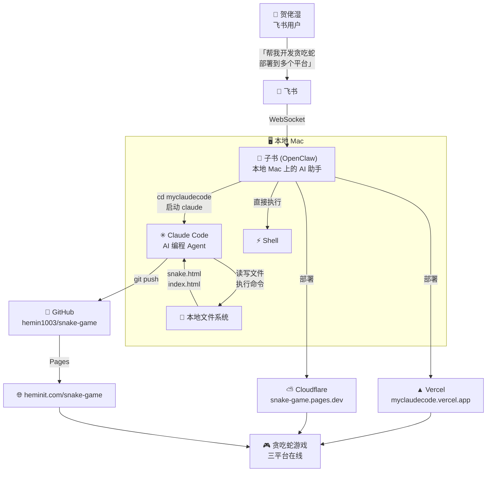
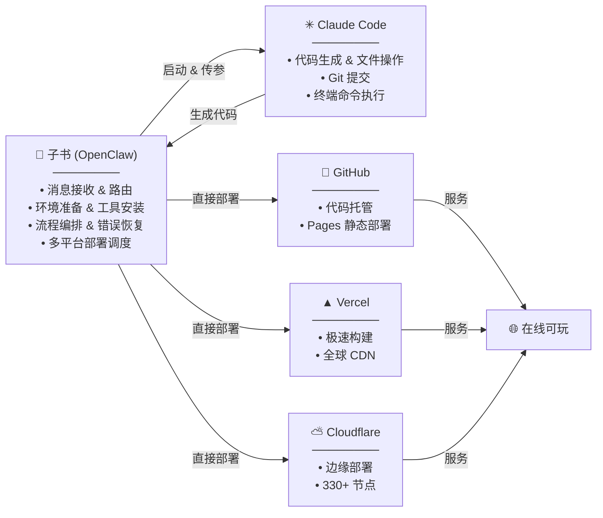
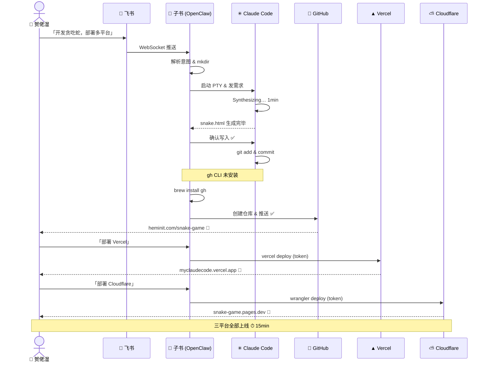

# 用 OpenClaw + Claude Code + GitHub + Vercel/Cloudflare 实现 Agent Coding

> 从飞书发一条消息，到贪吃蛇游戏三平台上线——全程 Agent 自动化

**一句话概括：** 在飞书里用自然语言告诉 AI 助手「帮我开发一个贪吃蛇游戏，推送到 GitHub，部署到 Vercel 和 Cloudflare」，全程无需打开 IDE、无需手动敲一行代码。

---

## 🏗 架构总览



---

## 🔄 完整流程拆解

### 1. 飞书 → OpenClaw 接收指令

贺佬湿在飞书里直接发消息：`帮我开发个贪吃蛇游戏，推送到 GitHub，部署到 Vercel 和 Cloudflare`。

飞书通过 WebSocket 连接把消息实时路由给本地 Mac 上的 OpenClaw 助手 **子书**，无需任何中转服务器。

> 💡 **关键点：** OpenClaw 自带飞书通道插件，配好 App ID/Secret 就能打通。消息通过 WebSocket 实时推送到本地 Gateway，延迟极低。

### 2. OpenClaw 理解意图 & 准备环境

子书（DeepSeek V4 Pro 驱动）解析需求，自动制定执行计划：

1. 创建 `myclaudecode` 工作目录
2. 启动 Claude Code 编写代码
3. GitHub 仓库创建 & 推送
4. 多平台部署（Vercel + Cloudflare）

```bash
mkdir -p ~/.openclaw/workspace/myclaudecode
```

### 3. Claude Code 生成游戏代码

子书通过 PTY（伪终端）启动 Claude Code，传入编程需求：

```bash
cd ~/.openclaw/workspace/myclaudecode && claude
# → 帮我开发一个完整的贪吃蛇游戏……
```

Claude Code 接到指令后：

- 🧠 分析需求：纯 HTML/CSS/JS 单文件、Canvas 渲染、键盘+触屏操控
- ⏳ Synthesizing（思考生成）约 1 分钟
- ✍️ 直接写入 `snake.html` — 475 行完整代码
- ✅ 子书代为确认权限，文件写入磁盘

> 💡 **关键点：** OpenClaw 通过 PTY 操控 Claude Code，不仅能发指令、读输出，还能代它确认权限弹窗。两个 Agent 不需要人类在中间当「传话筒」。

### 4. Git 提交 & 推送 GitHub

Claude Code 写好代码后执行 `git commit`，但发现 `gh` CLI 未安装。子书自动接管：

```bash
# 子书无缝接管环境安装
brew install gh                                  # 安装 GitHub CLI
echo "ghp_xxx" | gh auth login --with-token     # Token 认证

# 创建仓库 + 推送
gh repo create hemin1003/snake-game --public --push

# 复制 index.html 启用 GitHub Pages
cp myclaudecode/snake.html index.html
git add . && git commit && git push
```

> 💡 **关键点：** 这是「双 Agent 协作」的最佳体现。Claude Code 专注于代码生成，遇到环境依赖缺口时，OpenClaw 自动介入解决，不让流程中断。

### 5. 三平台自动部署

#### 🐙 GitHub Pages

代码推送后自动触发构建，自定义域名 `heminit.com` 直接生效。

#### ▲ Vercel（7 秒上线）

```bash
npx vercel deploy --token=vcp_xxx --prod --yes
→ Production: myclaudecode.vercel.app  ✅
```

- 零配置、自动检测静态站点
- 全球 CDN 分发、自动 HTTPS

#### ⛅ Cloudflare Pages（全球加速）

```bash
CLOUDFLARE_API_TOKEN="cfut_xxx" \
npx wrangler pages deploy . \
  --project-name=snake-game --branch=main
→ snake-game-11f.pages.dev  ✅
```

- 2.45 秒上传完成、全球 330+ 边缘节点
- 免费无限带宽

---

## 🎯 最终成果

| 平台 | 地址 |
|------|------|
| 🐙 **GitHub仓库** | [github.com/hemin1003/snake-game](https://github.com/hemin1003/snake-game) |
| 🌐 **试玩地址GitHub Pages** | [heminit.com/snake-game](http://heminit.com/snake-game/) |
| ⛅ **试玩地址Cloudflare** | [snake-game-11f.pages.dev](https://snake-game-11f.pages.dev) |
| ▲ **试玩地址Vercel** | [myclaudecode.vercel.app](https://myclaudecode.vercel.app) |
| ⏱ **耗时** | 从发消息到三平台全部上线 ≈ 15 分钟 |

---

## 🧩 核心角色分工



---

## 📋 时序图



---

## 🔑 关键技术点

### 1. OpenClaw 多通道消息路由
通过插件体系支持飞书、微信、钉钉、Discord。消息通过 WebSocket 实时推送到本地 Gateway。

### 2. PTY 代理控制 Claude Code
OpenClaw 通过伪终端（PTY）启动并操控 Claude Code：发送指令 → 读取响应 → 代确认权限 → 继续执行，全程无需人工介入。

### 3. 双 Agent 协作
子书（OpenClaw）负责环境编排 + 多平台部署；Claude Code 负责代码生成。遇到依赖缺口自动互补。

### 4. Token 驱动的全自动化
GitHub、Vercel、Cloudflare 全部通过 API Token 驱动，用户只需提供一次 Token。

### 5. 多平台覆盖策略

| 平台 | 优势 | 上线速度 |
|------|------|----------|
| GitHub Pages | 代码即站点、自定义域名 | ~30 秒 |
| Vercel | 零配置、全球 CDN | 7 秒 |
| Cloudflare | 330+ 节点、无限带宽 | 2.5 秒 |

---

## 🚀 总结

> **这个流程的本质：**
>
> 将「人在 IDE 里写代码 → git 推送 → 逐个平台手动部署」的传统开发流程，变成「**在飞书里说一句话 → Agent 自动完成全部 → 三平台同时上线**」。

**核心能力栈：**

- **OpenClaw** — 消息路由 + 环境编排 + 流程调度
- **Claude Code** — 代码生成 + 文件操作 + Git 提交
- **GitHub** — 版本管理 + Pages 静态部署
- **Vercel** — 极速构建 + 全球 CDN
- **Cloudflare** — 边缘网络 + 无限带宽

---

<p align="center">
  <sub>📅 2026-07-03 · 子书 (OpenClaw + DeepSeek V4 Pro) + Claude Code (Sonnet 4.6)<br>
  🤖 本文档从编写到部署，全部由 AI Agent 自动完成。<br>
  🎮 <a href="https://myclaudecode.vercel.app">Vercel</a> · <a href="https://snake-game-11f.pages.dev">Cloudflare</a> · <a href="http://heminit.com/snake-game/">GitHub Pages</a></sub>
</p>
